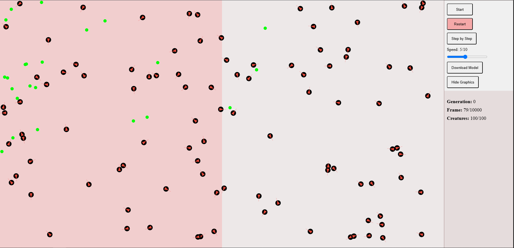

# Evolutionary Neural Network Simulation



This project simulates natural selection using neural networks, where virtual creatures evolve movement strategies to survive and reproduce in a 2D environment. Built with vanilla JavaScript and Canvas, it demonstrates how simple neural networks can develop complex behaviors through genetic algorithms.

## Key Features

- **Neural Network Brains**: Each creature has a feedforward neural network that processes sensory inputs
- **Evolutionary Mechanics**:
  - Selection: Only creatures reaching the right side can reproduce
  - Mutation: 6% chance of neural network mutations during reproduction
  - Fitness: Based on distance traveled and energy conservation
- **Environmental Factors**:
  - Food sources that replenish energy
  - Obstacles that must be navigated
- **Visualization**: Real-time rendering of creature movements and sensor inputs

## Simulation Rules

### Creature Behavior
- Inputs: Distance sensors (front, left, right), hunger level, energy level
- Outputs: Movement directions (up, down, left, right)
- Energy system: Movement consumes energy, eating food replenishes it

### Evolutionary Process
1. Initial random population (100 creatures)
2. Each generation lasts 2000 frames
3. Creatures reaching the right side reproduce
4. Offspring inherit neural networks with possible mutations
5. Process repeats for 50+ generations

## Technical Implementation

- **Neural Network**:
  - Architecture: [5, 16, 16, 4] (input, hidden, output)
  - Activation: Leaky ReLU (hidden), Linear (output)
  - Dropout: 20% for regularization
- **Physics**:
  - Basic collision detection and response
  - Energy-based movement constraints

## Getting Started

### Requirements
- Modern browser (Chrome/Firefox recommended)
- No dependencies - pure JavaScript

### Installation
```bash
git clone https://github.com/yourusername/neural-evolution.git
cd neural-evolution
```

### Running
1. Open `index.html` in your browser
2. Watch generations evolve automatically
3. Use debug mode (set `DEBUG_MODE = true`) to see sensor inputs

## Project Structure
```
neural-evolution/
├── index.html        # Main entry point
├── js/
│   ├── creature.js   # Creature class with neural network
│   ├── food.js       # Food source implementation
│   ├── nn.js         # Neural network implementation
│   ├── simulation.js # Main simulation loop
│   └── utils.js      # Helper functions
├── css/
│   └── style.css     # Basic styling
└── assets/           # Optional image assets
```

## Configuration Options
Modify `simulation.js` to adjust:
- Population size (`initialPopulationSize`)
- Mutation rate (`mutationRate`)
- Food distribution (`maxFoodAmount`)
- Generation length (`generationLength`)

## Future Enhancements
- Add predators to create more evolutionary pressure
- Implement more complex environments with varying terrain
- Add sexual reproduction with gene crossover
- Visualize neural network connections in real-time
- Export/import successful genomes

## Learning Resources
This project demonstrates:
- Neuroevolution (combining NNs with genetic algorithms)
- Simple reinforcement learning
- Emergent behavior from simple rules

## License
MIT License - free for educational and personal use